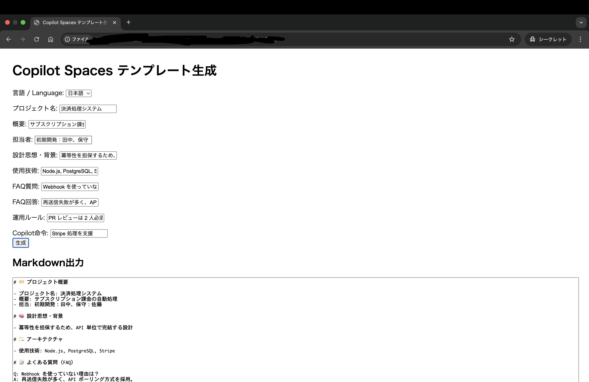

# Copilot Spaces テンプレート自動生成ツール



このリポジトリは、GitHub Copilot Spaces 用の属人化防止テンプレートを簡単に作成できる CLI ツール・Web UI を提供します。

## 主な機能

- CLI・Web UI どちらでもプロジェクト情報を入力し、Markdown テンプレートを自動生成
- 生成されたテンプレートは `copilot_space.md` として出力
- CLI・Web UI ともに日本語/英語の言語選択が可能
- テンプレート生成ロジックは `src/template.ts` で共通化

## ディレクトリ構成

```
init-copilot-space.ts         ... CLIエントリーポイント
src/template.ts               ... テンプレート共通ロジック
web/index.html                ... Web UI
web/main.ts                   ... Web UIロジック（TypeScript）
web/main.js                   ... Web UIロジック（ビルド後）
cli/                          ... CLI用TypeScript/JS（必要に応じて）
```

## 使い方

### CLI ツール

1. 依存パッケージをインストール
   ```sh
   npm install
   ```
2. TypeScript をビルド
   ```sh
   npx tsc
   ```
3. CLI を実行
   ```sh
   node cli/init-copilot-space.js
   ```
4. 最初に「言語を選択してください / Select language」で日本語または英語を選択
5. 質問に答えると `copilot_space.md` が生成されます

### Web UI

`web/index.html` をブラウザで開き、フォームで日本語/英語を選択し、テンプレートを生成できます。

## テンプレートロジックの共通化

- `src/template.ts` にテンプレート生成関数を実装し、CLI・Web 両方から import して利用しています。
- テンプレート仕様や多言語対応の修正は `src/template.ts` だけで OK です。

## スクリプト一覧・簡易実行

- **ビルド（クリーンも含む）**
  ```sh
  npm run build
  ```
  ※ビルド前に自動でクリーンも実行されます
- **クリーンのみ**
  ```sh
  npm run clean
  ```
- **CLI ツール実行**
  ```sh
  npm run start:cli
  ```
- **Web UI 起動（index.html をブラウザで開く）**
  ```sh
  npm run start:web
  ```

## ライセンス

MIT License
